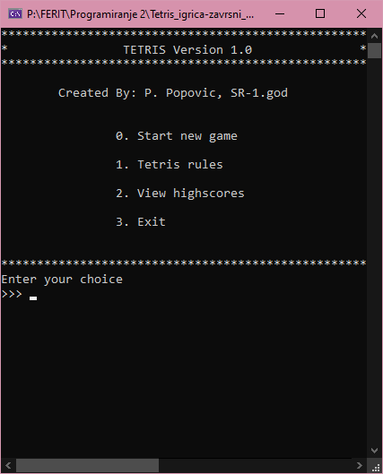
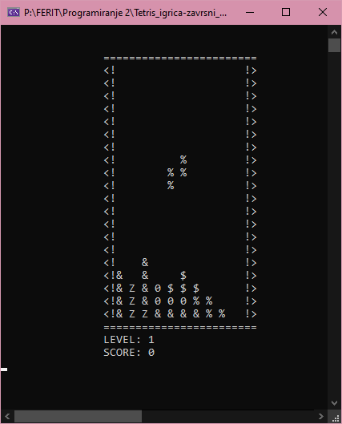
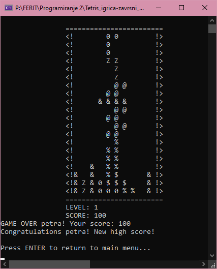
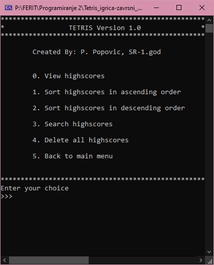
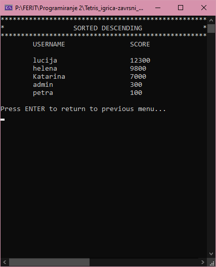

# Tetris Game - Final Project

## Description

This project implements a classic Tetris game using the C programming language. Tetris is a tile-matching puzzle video game originally designed and programmed by Alexey Pajitnov. The objective is to manipulate tetrominoes (geometric shapes composed of four square blocks each) to create complete lines on a grid, which then disappear. The goal is to prevent the tetrominoes from stacking up to the top of the playing field.

## Screenshots

### Main Menu

### Gameplay

### Gameover

### Highscore menagment menu

### Highscores sorted in descending order

## Features

- **Classic Tetris Gameplay**: Includes standard Tetris rules, block rotations, and movement.
- **Highscore Management**: Save, view, and manage high scores. Sort highscores in ascending or descending order.
- **Game Rules Display**: Displays the rules of the game.
- **Dynamic Memory Management**: Efficiently uses dynamic memory allocation for the game board and other elements.
- **Error Handling**: Provides robust error handling for file operations and memory allocations.

## Project Structure

The project is organized into several modules:

- **main.c**: Initializes the game and displays the main menu.
- **menu.c / menu.h**: Manages the main and highscore menus.
- **tetris.c / tetris.h**: Contains the core game logic, including initialization, gameplay, and user input handling.
- **score.c / score.h**: Manages user scores, including saving, loading, and sorting highscores.
- **rules.txt**: Contains the game rules displayed in the menu.
